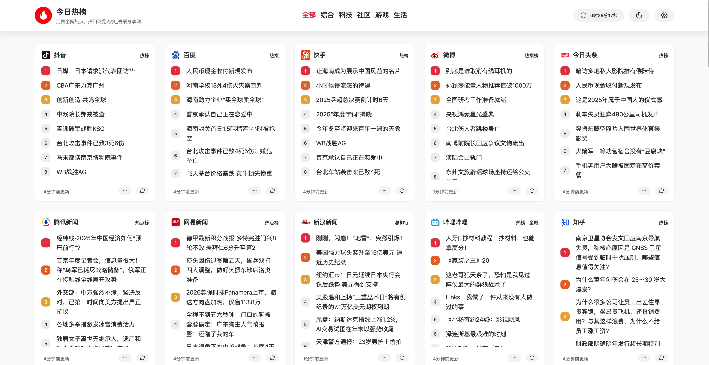
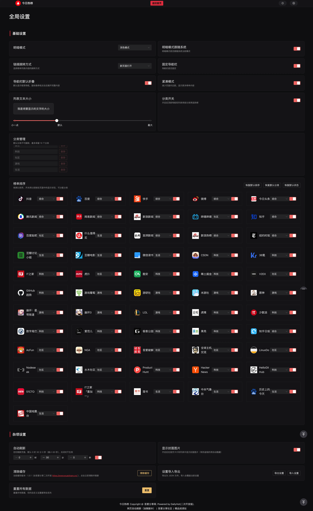

<div align="center">

<h2>今日热榜</h2>
<p>汇聚全网热点，热门尽览无余。吾爱分享网二次开发+自用版本。by www.wuaishare.cn</p>
<br />


</div>


## 示例

> 这里是示例站点

- [今日热榜 - https://hot.wuaishare.cn/](https://hot.wuaishare.cn/)

## 功能亮点

- 榜单可拖拽排序、显示开关、分类分配
- 分类管理与分类导航筛选
- 自动刷新与倒计时控制（支持暂停/继续）
- 设置导入导出，方便备份迁移
- 备用 API 自动回退，失败时自动切换并记住
- 主题切换、紧凑模式、列表字体大小与跳转方式
- 热榜源有封面图数据且无防盗链时会自动显示新闻封面图（首页鼠标悬浮显示、列表页直接显示）
- 设置页面、列表页面布局优化
- 已同步对接 DailyHotApi 中的所有热榜接口

## 后续 AI 榜单方向

- 已在 `DailyHotApi` 的 README 中增补「AI 信息源扩展规划（2026-06）」并同步第一阶段接入状态。
- 当前 `AI` 一级分类已纳入前端来源清单的第一阶段来源包括：
  - Artificial Analysis
  - LMArena
  - DesignArena
  - AICPB 榜单
  - LLM Stats
  - Skills Rank
  - OpenRouter
  - ClawHub Skills / Plugins
  - OpenAI
  - OpenAI Research
  - Anthropic
  - DeepMind
  - Meta AI
  - Hugging Face 博客 / 模型 / 热门论文
  - Papers with Code
  - Mistral
  - Cohere
  - Product Hunt
  - Hacker News
  - 新浪 AI 热榜
- 当前仍在待攻坚来源：
  - Perplexity Blog
  - xAI News
  - Reddit 相关 AI 社区

- 说明：
  - `OpenRouter` 当前已切到公开前台榜单接口，支持模型周榜、厂商份额、应用榜、性能榜等多个官方子榜。
  - `ClawHub Plugins` 的 `Official only` / 多数官方分类接口当前在服务端直连场景下仍不稳定，因此前端只展示已验证可用的子类；后端预留已保留，后面官方稳定后可直接放开。

## 下一波高价值来源

- `Google AI / Google Developers AI`
  - 价值：Gemini、Vertex AI、A2A / Agent 生态、开发者能力更新快，适合补官方工程动态。
- `Microsoft AI / Azure AI / Microsoft Research`
  - 价值：Copilot、Phi、企业落地、研究与产品双线并行，实用性强。
- `NVIDIA Technical Blog / Research`
  - 价值：推理基础设施、GPU、TensorRT-LLM、NIM、Agent infra，偏工程实战。
- `Qwen / ModelScope`
  - 价值：中文 AI 圈一手模型、Agent、开源生态信息源。
- `LangChain / LangGraph Changelog`
  - 价值：Agent 应用层工具链更新频繁，适合面向实战用户。
- `vLLM / Ollama / Open WebUI`
  - 价值：开源推理与本地部署生态的高频必看源，适合补“能直接用”的 AI 工程内容。


## 部署

```bash
// 安装依赖
pnpm install

// 开发
pnpm dev

// 打包
pnpm build
// 构建时会预渲染 首页 / 榜单页，并生成 sitemap.xml 与 robots.txt
```

## 环境变量

- `VITE_GLOBAL_API`：热榜 API 地址。
- `VITE_GLOBAL_API2`：备用热榜 API 地址（可选，主 API 失败会自动切换并记住）。
- `VITE_SITE_URL`：站点线上域名（用于生成 `sitemap.xml`/`robots.txt` 与 canonical），注意用完整域名（含 'https://'），不要带末尾 '/'。
- `VITE_ICP`：ICP 备案号（可选）。
- `VITE_DIR`：站点部署路径（如 `/` 或子目录路径）。
- `VITE_BUILD_NUMBER`：构建号覆盖值（可选；默认使用最近一次前端代码提交时间，用于 `v1.4.4 (构建号)` 展示与缓存刷新）。
- `PRERENDER`：是否开启预渲染（默认关闭；本地需要预渲染时设置 `PRERENDER=true pnpm build`，Vercel 等 CI 若缺少 chromium 依赖请保持默认）。

## 缓存版本

展示版本来自 `package.json`，格式为 `v1.4.4 (YYMMDDHHMM)`；括号内版本号默认取最近一次前端代码提交时间，例如 `2606102007`。这里的“代码提交”只统计 `src/`、`public/`、`api/`、`index.html`、`package.json`、`vercel.json` 等实际影响站点产物的路径，不会因为单纯修改 `README` 或构建脚本说明文字而改变页脚版本。若本地或 CI 无法读取 Git 提交时间，则退回到构建当下的 `YYMMDDHHMM`，避免出现 `00.0000.000000` 或时间戳样式的难读版本号。

## Vercel 部署

现已支持 Vercel 一键部署，无需服务器

> 请注意，需要修改环境变量中的 API 地址


